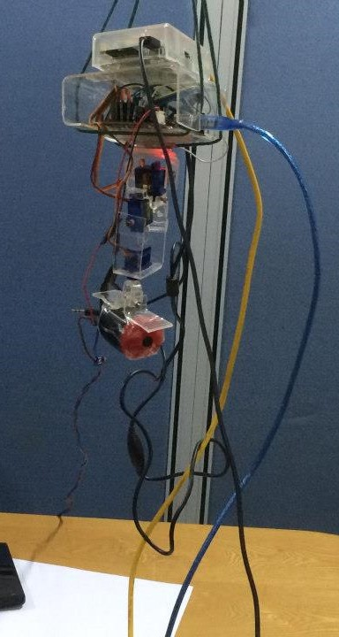
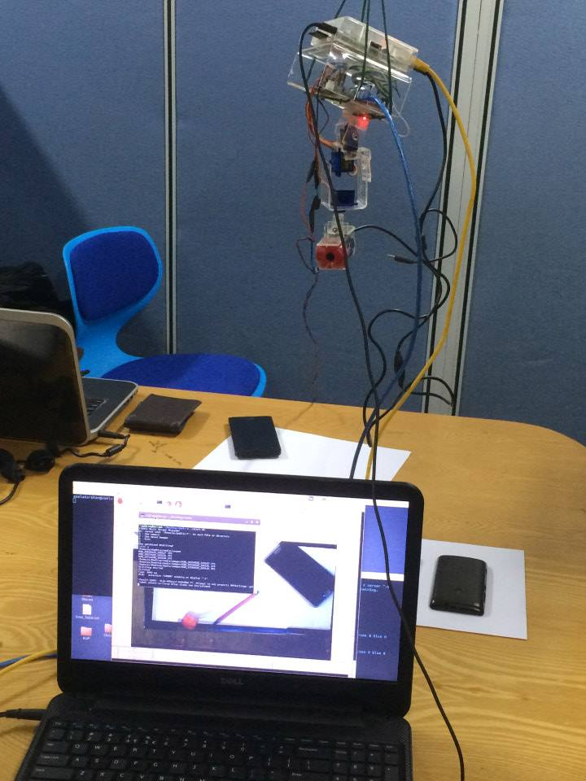
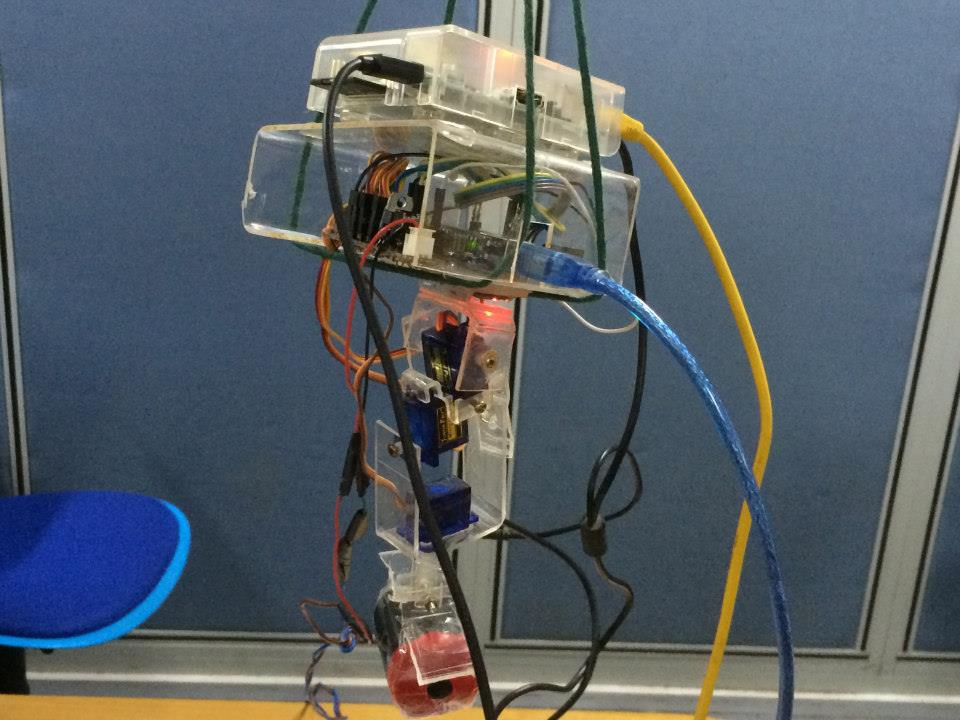

# SkyLyzer
Stabilized camera platform to get images from a quad-copter and using image processing stitch images and identify overflow areas

Raspberry Pi
  We are using Raspberri Pi as a our development enviornment and also as our final product. We are usign OpenCV on our project to do image stitching. 

Raspbian OS
  We are using Raspbian Os, which is a linux OS on Raspberriy Pi for the project
   Proxy Settings
   
           Acquire::http::Proxy "http://yourproxyaddress:proxyport";
           (/etc/apt/apt.conf.d)
           
  static IP Address
  change
  
          iface eth0 inet dhcp
            
  to
  
          iface eth0 inet static
          address XXX.XXX.XXX.XXX
          netmask XXX.XXX.XXX.XXX
          network XXX.XXX.XXX.XXX
          gateway XXX.XXX.XXX.XXX
          broadcast XXX.XXX.XXX.XXX
              
              
  You don't need to add all the lines, usually address and netmask is enough to do a SSH on RPI(Raspberry Pi)
  
      (/etc/network/interfaces)
      
  Or you can use dhcp and use nmap on linux/ubunut to search your RPI on the network
  It is suggested to use "ping raspberrypi" but so far it didnt work.
  (http://raspberrypi.stackexchange.com/questions/12440/ssh-into-raspberry-pi-without-knowing-ip-address)
    
OpenCV
  We used below command to install OpenCV on Raspberry Pi
        
        sudo apt-get install libopencv-dev python-opencv
    
VNC Server on Raspbian OS to remote access
        
        sudo apt-get install xtightvncviewer

You can always SSH to RPI, usually SSH is switched on default with password: pi and password: raspberrypi

currently if opencv build using cmake we can use cmake to build our program
just create CMakeLists.txt and run commane cmake .
then make

Performance Tests Reference Links
http://www.educ8.me.uk/Dig_Stud/RPi/Pi_timelapse_p3_fs.html

We tested stitch program by 
1. Increasing number of images
2. Decreasing overlap 100% 75% 50%

Measured the memory card write speed ( current 4GB class 4 )
1. Taking many images with different frequencies

#### Project

